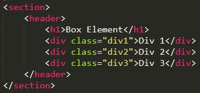
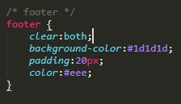

# Langkah-langkah Praktikum Persiapan membuat dokumen HTML dengan nama file lab4_box.html.
* Input

* Output

# Membuat Box Element Kemudian tambahkan kode untuk membuat box element dengan tag div seperti berikut.
* Input

* Output

# CSS Float Property Selanjutnya tambahkan deklarasi CSS pada head untuk membuat float element, seperti berikut.
* Input

* Output

# Mengatur Clearfix Element Clearfix digunakan untuk mengatur element setelah float element. Property clear digunakan untuk mengaturnya. 
Tambahkan element div lainnya seteleah div3 seperti berikut. 
* Input

* Output

# Lakukan eksperimen terhadap penggunaan property clear dengan nilai lainnya (left, both, right), dan amati perubahannya.  
* Input

* Output 

# Membuat layout sederhana
* Input

* Validasi HTML, ada yang error itu karena di dalam section belum ada heading.

* Output

# Menambah kode css untuk membuat layoutnya.

* Input

* Output

# Membuat navigasi
* Input

* Output

# Membuat Hero panel, menambahkan kode HTML dan CSS.
* Input

* Output 

# Mengatur layout Main dan Sidebar, menambahkan kode css.
* Input

# Membuat sidebar widged, menambahkan html dan css.
* Input

* Output

# Mengatur footer, menambahkan css.
* Input

* Output

# Menambah element lain pada main content, menambahkan html dan css.
* Input

* Output

# Menambahkan content artiker, html dan css.
* Input

* Output

### Pertanyaan dan Tugas 
### 1. Tambahkan Layout untuk menu About => buat single layout yang berisi deskripsi, portfolio, dll 
### 2. Tambahkan layout untuk menu Contact => yang berisi form isian: nama, email, message, dll 

### Jawaban.
### 1. Input 

* Output 

### 2. Input

* Output

